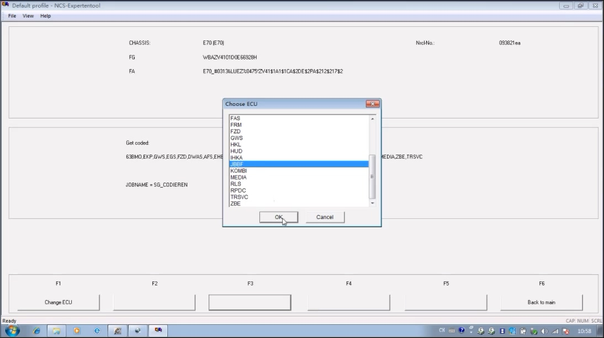
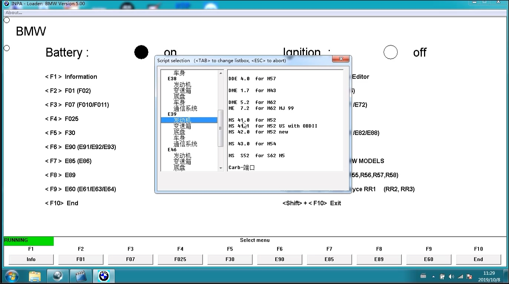
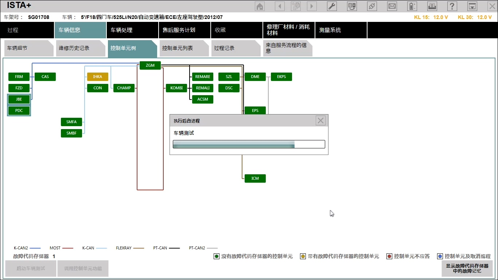
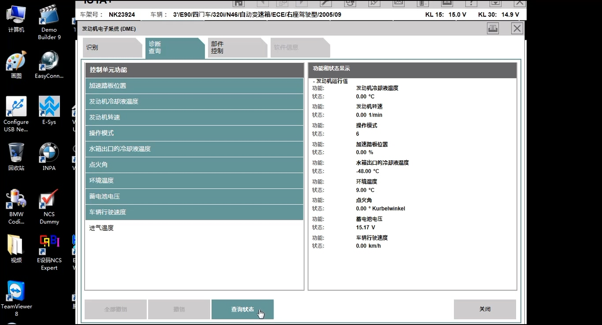
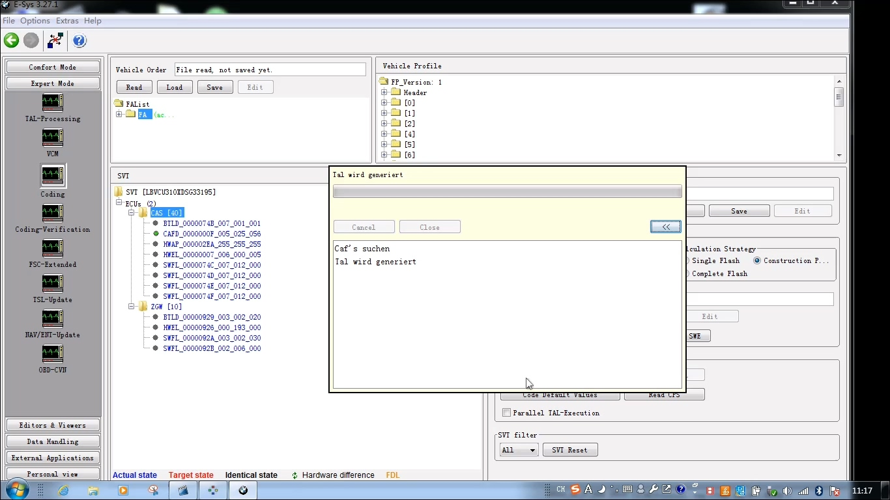

#  宝马车辆诊断案例 

## 宝马E系工程师编程和设码[视频][New]
[查看详细步骤...

](e70/index.md)

## INPA软件的简单进入操作[视频]
[查看详细步骤...

](inpa/index.md)

## 宝马525Li车辆ISTA-D诊断[视频]
[查看详细步骤...

](525li/index.md)

## 宝马320i车辆ISTA-D数据流查询[视频]
[查看详细步骤...

](320i/index.md)

## 宝马F18 E-Sys编码[视频]
[查看详细步骤...

](f18_e-sys_coding/index.md)

